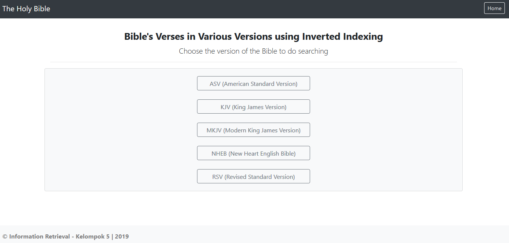

# Basic Inverted Index for Bible Search
>Bible serch in basic inverted index using Django Framework

The steps implemented in this program :
1. Reading XML file
2. Find the root of the XML file
3. Save the Bible's book names, Bible's Verses Number, and Verses text
4. Perform the normalization processes:
    - Tokenization
    - Case Folding
    - Stemming
    - Stopword Removal
5. Perform inverted index to find the frequency and verses number of each term located on each document
6. Perform the normalization processes for the program's input:
    - Tokenization
    - Case Folding
    - Stemming
    - Stopword Removal
    - Save the normalized query
7. Perform the tf-idf of the normalized query with the result of inverted index where the term(s) in query located on each document
8. Sort the score of tf-idf and return the top-10 verses with the highest score

## Requirements

- `pip install django` is required

## Documents
The bible's versions are:
1. American Standard Version (ASV)
2. King James Version (KJV)
3. Modern King James Version (MKJV)
4. New Heart English Bible (NHEB)
5. Revised Standard Version (RSV)

## Running the Examples

1. `clone` the projects
2. `cd` into the projects folder and run the main script.

For example (Windows) :

    $ python manage.py runserver